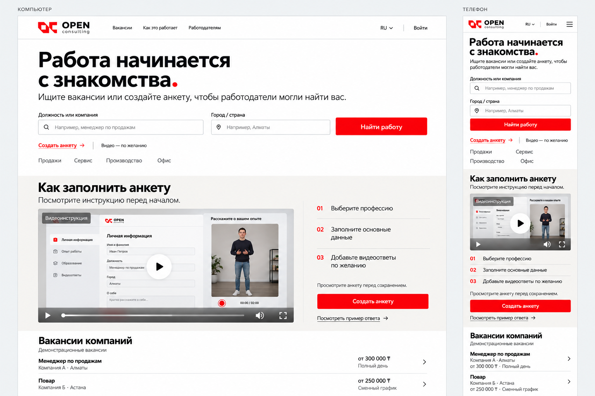

# Главная Open Consulting — A2

Статус: доработка выбранного пользователем варианта A; статическая концепция, не финальная реализация.

## Изменения
- Сохранены светлый фон, шрифт без засечек, красные акценты, поиск сверху и видео ниже.
- У полей поиска один контур; подписи над полями. На телефоне поля расположены вертикально.
- Пояснение показывает поиск вакансий и создание анкеты как два доступных действия.
- Видеораздел посвящён инструкции по заполнению; пример ответа доступен отдельной ссылкой.
- Три шага: профессия, основные данные, необязательные видеоответы. Есть просмотр анкеты до сохранения.
- В шапке телефона показана кнопка меню; категории перенесены на две строки.
- У вакансий видны должность, компания, город, зарплата и график. Записи помечены как демонстрационные.

## Просмотр результата и ограничения
Полученное изображение просмотрено: поиск и видео разделены, двойная рамка полей убрана, меню телефона добавлено. Внутри видеопревью генератор добавил пример имени и таймер 02:00; это иллюстративные данные, не установленные требования к анкете. Компании А и Б, зарплаты и человек — демонстрационный материал. Мелкие подписи формы внутри видео не следует использовать как готовую спецификацию интерфейса.

Поведение меню, поиска, плеера и адаптивность в браузере не проверялись. При точной вёрстке использовать оригинальный логотип. Мобильную версию далее проработать в полном размере с удобными зонами нажатия.

## Промпт
Создано встроенным Imagegen как редактирование homepage-direction-a.png.

Edit the attached Open Consulting website concept A to produce iteration A2. Use case ui-mockup. Preserve the chosen visual identity: flat white background, black modern sans-serif, red OC logo and red actions, crisp thin borders, no gradients/shadows/glass, left-aligned content, generous but useful space. Preserve desktop LEFT and mobile RIGHT presentation with small labels КОМПЬЮТЕР and ТЕЛЕФОН. Create a high resolution landscape board with enough vertical space to show hero, complete tutorial video section and two detailed job rows. Same Russian content on both versions, mobile actually adapts into a vertical flow. Keep logo design and headline exactly "Работа начинается с знакомства." red final dot. Desktop headline slightly smaller than original to make space for useful content. Header logo, Вакансии, Как это работает, Работодателям; RU, Войти. Mobile compact logo, RU, Войти and clearly visible hamburger menu. No desktop navigation forced into mobile header.

CHANGE 1 hero explanation to exactly "Ищите вакансии или создайте анкету, чтобы работодатели могли найти вас." Beneath search action show "Видео — по желанию". Search fields labels outside ABOVE a SINGLE thin bordered input each; NO nested double containers. Inputs "Должность или компания" with placeholder "Например, менеджер по продажам" and "Город / страна" placeholder "Например, Алматы". Desktop one row two fields and red "Найти работу" button all same height. Mobile stacked input fields full width, then search button. Secondary action "Создать анкету →". Plain small category links Продажи, Сервис, Производство, Офис, mobile can wrap two rows to preserve legibility.

CHANGE 2 video section BELOW hero/search on very light warm-gray background. Heading exactly "Как заполнить анкету". Description "Посмотрите инструкцию перед началом." Desktop main wide video left, clear instructional steps right. Mobile title, wide video, steps and action below. Video thumbnail should be a believable screencast tutorial, showing actual clean form interface and vertical recording preview of a naturally dressed man standing full-body on right side of screencast; form fields on left, question "Расскажите о вашем опыте" above camera in screencast only. The thumbnail is NOT just a full-screen portrait. Large play button and short clear label "Видеоинструкция". Normal minimal video player controls along bottom. NO fake time duration or five-question requirement. To right outside video exactly three plain rows separated by fine lines with small red step numbers: "01 Выберите профессию"; "02 Заполните основные данные"; "03 Добавьте видеоответы по желанию". Below small text "Просмотрите анкету перед сохранением." Red button "Создать анкету". Beneath it secondary underlined link "Посмотреть пример ответа →". No separate giant interview question panel; this is a homepage tutorial rather than an actual recording screen.

CHANGE 3 bottom heading "Вакансии компаний" and clearly visible qualifier "Демонстрационные вакансии". Two distinct tidy list rows separated by a fine rule, NOT decorative cards, with legible job title strongest, company and place line, salary and schedule. Row 1 title "Менеджер по продажам", second line "Компания А · Алматы", salary "от 300 000 ₸", schedule "Полный день". Row 2 title "Повар", second line "Компания Б · Астана", salary "от 250 000 ₸", schedule "Сменный график". Desktop align salary to right, small arrow. Mobile information wraps naturally, minimum readable type. No fabricated real company logos or claims. Preserve clear hierarchy and uncluttered brand. Do not alter style to serif, don't add ornamental shapes or new marketing blocks. Render all Russian text accurately, no tiny filler. Flat exact interface concept, no device chrome, no perspective.
