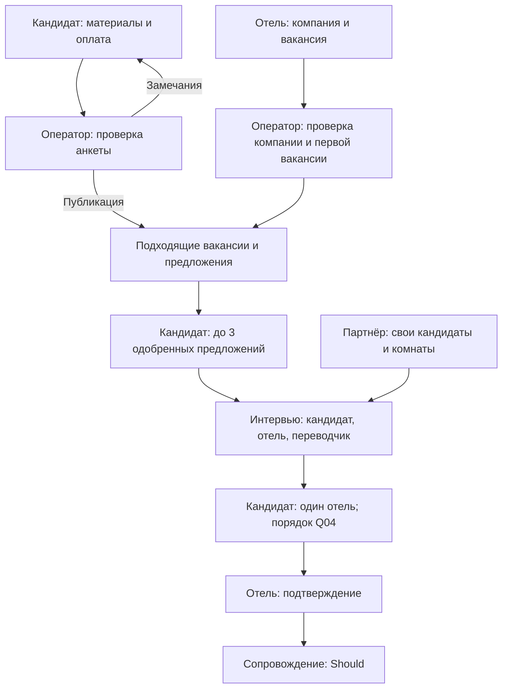

# Карта экранов и сценариев Open Consulting

**Этап 1: подготовленная структура для обсуждения. Версия 0.1, 5 октября 2026 года.**

Основа: [ТЗ версии 1.1](../../TZ_OPEN_CONSULTING_V1_1.md). Визуальное направление по указанию пользователя: современный деловой интерфейс. Конкретный стиль разрабатывается на следующем этапе.

Карта различает требования ТЗ и предложения по UX. Названия и разделение экранов предложены для проектирования. Наличие карты не означает готовую реализацию или утверждение спорных требований.

В реестре **81 групп экранов**. Окна, варианты и состояния входят в соответствующие группы. Полный объём шире количества страниц.

[Интерактивная карта и структурные схемы](./index.html) · [Реестр для дальнейшего проектирования](./screen-registry.json)

## Условные обозначения

- **Must** — требование ТЗ для пилота.
- **Should** — первая коммерческая версия; состав пилота уточняется.
- **База** — описано в полях, матрице, NFR или сценариях без явного приоритета.
- **UX** — предложенная организация интерфейса.
- **Уточнить / Qxx** — открытый вопрос, не утверждённое решение.

## Навигация и основной путь

### Публичный сайт

**Меню:** Вакансии · Как это работает · Кандидатам · Работодателям · Партнёрам · Новости · Контакты.

Главная, новости и информация доступны до входа. Гостевой просмотр вакансий — открытый вопрос.

**Основной путь:** G01 Главная → G03 Кандидатам → A01 Выбор пути и роли.

### Вход и доступ

**Меню:** Роль · Телефон / ЭЦП · Согласия · Проверка · Источник.

Роль оператора или партнёра назначается по правам. Самостоятельный выбор роли не должен выдавать служебный доступ.

**Основной путь:** A01 Выбор пути и роли → A02 Телефон → A03 Одноразовый код → A05 Согласия → A06 Проверка лица → A07 Источник и партнёр → C02 Личные данные.

### Кабинет кандидата

**Меню:** Обзор · Моя анкета · Вакансии · Предложения · Собеседования · Мой отель · Оплата · Уведомления.

Подходящие вакансии после публикации. До трёх одновременно одобренных предложений, одно окончательное место.

**Основной путь:** C01 Главная кандидата → C02 Личные данные → C03 Опыт и языки → C04 Профессии и ожидания → C05 Четыре фотографии → C06 Видеопрезентация → C08 Документы → C09 Готовность к публикации → X06 Оплата и партнёрское покрытие → C10 Публикация и модерация → C11 Подходящие вакансии → C13 Предложения → C15 Мои собеседования → X04 Видеокомната → C16 Окончательный выбор → C17 Выбранный отель → X09 Трек сопровождения.

### Кабинет отеля

**Меню:** Обзор · Компания · Вакансии · Кандидаты · Предложения · Собеседования · Сотрудники · Оплата.

Компания проверяется до публикации. Отель видит документы кандидата в виде статусов; доступ после подтверждения требует уточнения.

**Основной путь:** E01 Главная отеля → E02 Компания и условия → E03 Документы компании → E04 Проверка компании → E06 Создание и изменение вакансии → E07 Состояние вакансии → E08 Кандидаты и отклики → E09 Карточка кандидата → E10 Предложения и отклики → X01 Назначение собеседования → X04 Видеокомната → E12 Результат собеседования → E14 Сотрудник и сопровождение → X09 Трек сопровождения.

### Кабинет Open Consulting

**Меню:** Обзор · Проверки · Документы · Отбор · Собеседования · Сопровождение · Партнёры · Контент · Тарифы · Отчёты · Журнал.

Полный контур по ТЗ: решения, перевод, документы, источники, контент и тарифы. Открытия файлов и изменения фиксируются.

**Основной путь:** O01 Главная оператора → O02 Очереди проверок → O03 Проверка и решение → O04 Проверка документов → O05 Расписание и перевод → X04 Видеокомната → O14 Контроль отбора и места → O06 Сопровождение и этапы визы → O13 Журнал действий.

### Кабинет партнёра

**Меню:** Обзор · Мои кандидаты · Собеседования · Отчёты · Мой источник.

Только собственные кандидаты, документы, интервью и отчёты. Контур подключения и совместного заполнения — открытый вопрос.

**Основной путь:** P01 Главная партнёра → P02 Свои кандидаты → P03 Регистрация своего кандидата → P04 Кандидат партнёра → P05 Свои собеседования → X04 Видеокомната → X09 Трек сопровождения → P06 Свои отчёты.

### Общие процессы

**Меню:** Назначение · Подготовка · Комната · Запись · Оплата · Уведомления · Сопровождение.

Общие экраны меняют доступные действия по роли. Кандидат и отель не получают доступ к записи интервью по текущей матрице.

**Основной путь:** X01 Назначение собеседования → X02 Карточка собеседования → X03 Подготовка камеры и звука → X04 Видеокомната → X05 Запись собеседования.

## Связь участников

1. Кандидат комплектует анкету; оператор проверяет её. Замечание возвращает на конкретный шаг, одобрение открывает публикацию.
2. Отель комплектует компанию; оператор проверяет её. Затем отель публикует вакансию, первую через модерацию.
3. Отклик или приглашение создаёт предложение. Кандидат одобряет до трёх; отель, оператор или свой партнёр назначает интервью.
4. Кандидат и отель входят в комнату; оператор или партнёр своей анкеты может переводить. Оператор имеет доступ к записи, партнёр только собственной комнаты.
5. Временная последовательность выбора: кандидат выбирает один отель, остальные получают отказ; отель подтверждает; открывается сопровождение. Порядок и отказ отеля — Q04.
6. Оператор ведёт этапы сопровождения; партнёр видит своих, отель выполняет свою часть вне платформы и отмечает статусы. Автоматическая подача в e-İzin не предусматривается.

### Схема ключевой связи

## Реестр экранов

Доступ относится к данным и действиям. Реальное ограничение прав обеспечивается на сервере после этапа интерфейса. Переходы в таблице показывают возможные маршруты, а не выдачу доступа всем ролям.

### Публичный сайт

| ID / экран | Цель | Вход и главное действие | Следующие экраны | Доступ | Основа / приоритет | Состояния |
| --- | --- | --- | --- | --- | --- | --- |
| G01 — Главная | Объяснить найм в отели Турции и предложить путь кандидату или отелю | Прямой вход на сайт → Ищу работу / Я работодатель | A01, G02, G03, G04, G05, G06, G08, G10 | Без входа | FR-UI-01/02/03 / Must | Гость; вошедший пользователь; рекламный слот пуст / заполнен |
| G02 — Как это работает | Показать проверку, отбор, собеседование и сопровождение | G01 / меню → Начать свой путь | A01, G03, G04 | Без входа | FR-UI-01 / Must | Загрузка; пусто; ошибка; заполнено |
| G03 — Кандидатам | Объяснить материалы, оплату, три согласия и одно место | Меню / главная → Создать анкету | A01, G02 | Без входа | FR-UI-01; разделы 6–7, 11, 15 / Must | Загрузка; пусто; ошибка; заполнено |
| G04 — Работодателям | Объяснить удалённый отбор, проверку компании и тарифные пороги | Меню / главная → Зарегистрировать компанию | A01, G02 | Без входа | FR-UI-01; FR-EMP-01 / Must | Загрузка; пусто; ошибка; заполнено |
| G05 — Партнёрам | Объяснить собственный контур кандидатов, код и сопровождение | Меню → Посмотреть условия / контакты | G10 | Без входа | FR-UI-01; FR-PAR-01 / Must | Информация; порядок подключения партнёра требует решения Q10 |
| G06 — Вакансии на витрине | Показать структуру списка вакансий | Меню → Открыть вакансию | G07, A01 | Гостевой просмотр: Q01 | FR-UI-01; FR-ANK-01 / Уточнить | Список; фильтр; нет результатов; доступ ограничен |
| G07 — Вакансия на витрине | Показать обязанности, оплату, жильё и требования | G06 → Перейти к регистрации / подходящему отклику | A01, C12 | Просмотр гостем: Q01; отклик после публикации | FR-ANK-01; раздел 10 / Уточнить | Открыта; закрыта; требуется вход / публикация |
| G08 — Новости | Показать рубрики и закреплённые материалы | Меню / главная → Читать материал | G09 | Без входа | FR-UI-03 / Must | Лента; рубрика; закрепление; нет материалов на языке |
| G09 — Новость | Дать содержание, дату и язык материала | G08 → Вернуться к новостям | G08 | Без входа | FR-UI-03 / Must | Опубликована; отсутствует; нет языковой версии; комментариев нет |
| G10 — Контакты и реквизиты | Дать способы связи с Open Consulting | Меню / подвал → Связаться по указанным контактам | G01 | Без входа | FR-UI-01 / Must | Загрузка; пусто; ошибка; заполнено |
| G11 — Политика и оферта | Показать утверждённые условия и обработку данных | Подвал / согласие → Прочитать и вернуться | A05, G01 | Без входа | FR-UI-01; NFR-06 / База | Текст и версия; утверждённые тексты ещё нужны |

### Вход и доступ

| ID / экран | Цель | Вход и главное действие | Следующие экраны | Доступ | Основа / приоритет | Состояния |
| --- | --- | --- | --- | --- | --- | --- |
| A01 — Выбор пути и роли | Направить кандидата и компанию в нужный сценарий | Главная / вход → Продолжить в выбранной роли | A02, A04 | Гость; роли оператора/партнёра не выдаются самовыбором | FR-REG-01/02/03 / UX | Кандидат; отель; вход существующего участника |
| A02 — Телефон | Запросить номер для одноразового кода | A01 → Получить код | A03, A04 | Гость | FR-REG-01 / Must | Пусто; формат неверен; отправка; сервис недоступен |
| A03 — Одноразовый код | Подтвердить телефон и восстановить продолжение пути | A02 → Подтвердить код | A05, A06, C01, E01, O01, P01 | Владение телефоном; роль определяется учётной записью | FR-REG-01 / Must | Ожидание; неверный / истёкший код; повтор; подтверждено |
| A04 — Вход через ЭЦП | Показать процесс электронной идентификации | A01 / A02 → Подтвердить вход | A05, A06, C01, E01, O01, P01 | Возможности ЭЦП и роли: Q11 | FR-REG-01 / Must | Подготовка; ожидание; отмена; ошибка; успешно |
| A05 — Согласия | Раздельно объяснить анкету, запись и показ карточки отелям | Новая регистрация / первый соответствующий процесс → Сохранить выбранные согласия | A06, E02, G11 | Вошедший пользователь; по своему процессу | NFR-06 / База | Раздельные согласия; чтение условий; отказ; сохранение |
| A06 — Проверка лица | Подтвердить живого человека и совпадение материалов | Регистрация / возврат к проверке → Пройти проверку | A07, C01, O03 | Кандидат для себя; оператор вручную | FR-REG-01 / Must | Инструкция; камера; задания; успех; повтор; после 3 неудач ручная очередь |
| A07 — Источник и партнёр | Закрепить источник анкеты и код | Регистрация кандидата → Сохранить источник | C02, X06 | Кандидат; после публикации меняет только оператор | FR-REG-03; FR-PAR-01 / Must | Open Consulting; партнёр; код неверен; логотип; покрытие подтверждено |
| A08 — Профиль доступа и настройки | Управлять языком и подтверждённым телефоном | Меню вошедшего пользователя → Сохранить / подтвердить новый телефон | A02, C01, E01, O01, P01 | Только своя учётная запись | FR-REG-01; NFR-01 / База | Четыре языка; смена телефона с кодом; выход |

### Кабинет кандидата

| ID / экран | Цель | Вход и главное действие | Следующие экраны | Доступ | Основа / приоритет | Состояния |
| --- | --- | --- | --- | --- | --- | --- |
| C01 — Главная кандидата | Показать статус анкеты, следующий шаг и ближайшие события | Вход / меню кабинета → Продолжить следующий обязательный шаг | A06, C02, C10, C11, C13, C15, C17, X06, X08 | Только кандидат для себя | Раздел 6.2; FR-ANK-01 / UX | Черновик; лицо; заполнение; оплата; модерация; публикация; отбор; выбран; подтверждён; виза; выехал; снят; блокировка |
| C02 — Личные данные | Собрать обязательные паспортные сведения и контакты | C01 / A07 → Сохранить и продолжить | C03 | Своя анкета | Раздел 6.1 / База | Пусто; частично; неверный формат ИИН; сохранено |
| C03 — Опыт и языки | Собрать опыт и уровни четырёх языков | C02 → Сохранить и продолжить | C04 | Своя анкета | Раздел 6.1 / База | Без опыта; несколько мест; уровни; неполные поля |
| C04 — Профессии и ожидания | Выбрать 1–3 профессии, зарплату и готовность к условиям | C03 → Сохранить и продолжить | C05 | Своя анкета | Раздел 6.1; FR-ANK-01 / База | 0 / 1 / 3 профессии; попытка 4; валюта; обязательный ответ отсутствует |
| C05 — Четыре фотографии | Собрать лицо и три разных фото полного роста | C04 / замечание → Загрузить и продолжить | C06 | Своя анкета | FR-MED-01 / Must | 0–4 фото; загрузка; одинаковый кадр; ошибка; замена |
| C06 — Видеопрезентация | Записать один ролик с шестью вопросами | C05 / C01 → Записать, просмотреть и сохранить | C08, C07 | Своя анкета; до модерации обязательно | FR-MED-02 / Must | Инструкция; доступ к камере; кадр; запись 20–40 сек; просмотр; пересъёмка; лимит Q05 |
| C07 — Профессиональная видеоанкета | Добавить отдельные ответы по выбранной профессии | C06 / раздел анкеты → Сохранить ответы | C08 | Своя анкета; обязательность пилота Q02 | FR-MED-03; раздел 6.1 / Should | Вопросы; отдельные ответы; запись; просмотр; незавершено |
| C08 — Документы | Показать настраиваемый чек-лист и замечания к файлам | C06 / C07 / C01 → Добавить или исправить файл | C09 | Кандидат свои файлы; Q08 по доступу отеля | FR-DOC-01 / Must | Не собран; на проверке; готов; срок; замечание; сбой загрузки |
| C09 — Готовность к публикации | Свести заполнение и недостающие материалы | C08 → Оплатить / отправить готовую анкету | X06, C10, C02, C05, C06, C08 | Своя анкета; пройдены обязательные условия | UC-01; раздел 6 / UX | Материалы отсутствуют; оплата нужна; код покрыл; готово |
| C10 — Публикация и модерация | Объяснить ожидание проверки и замечания оператора | C09 / платёж / уведомление → Исправить замечание / открыть опубликованную анкету | C02, C05, C06, C08, C11, C18 | Своя анкета; отель только опубликованную | UC-01; раздел 6.2 / База | На модерации; нужны исправления; опубликована; снята; истекла; заблокирована |
| C11 — Подходящие вакансии | Показать вакансии по выбранным профессиям | C01 / меню → Открыть вакансию | C12 | Кандидат с опубликованной анкетой | FR-ANK-01 / Must | Список; фильтры; нет результатов; публикация неактивна |
| C12 — Вакансия и отклик | Дать условия работы и возможность отклика | C11 / G07 → Откликнуться | C13, C14 | Опубликованная анкета и совпадающая профессия | FR-ANK-01; раздел 10 / Must | Доступен отклик; уже отправлен; профессия не совпадает; вакансия закрыта |
| C13 — Предложения | Показать входящие и до трёх активных одобрений | C01 / отклик / уведомление → Рассмотреть предложение | C14 | Свои предложения | BR-01/04 / Must | Входящие; одобрено 0–3; истекло; отказ; место выбрано |
| C14 — Предложение и слот | Показать отель, срок и последствия одобрения | C13 → Одобрить или отказаться | C13, C15, C16 | Свой слот; максимум 3; один окончательный отель | BR-01/02/04 / Must | 72 часа; напоминание; 3 слота заняты; одобрено; отменено; истекло Q03 |
| C15 — Мои собеседования | Показать расписание, часовые пояса и режимы | C01 / C14 → Открыть собеседование | X02, C16 | Свои интервью | BR-05; FR-INT-01 / База | Нет интервью; назначено; перенесено; отменено; завершено |
| C16 — Окончательный выбор | Понятно подтвердить один отель и отказ другим | После интервью / предложения → Выбрать один отель | C17, C13 | Своя анкета; второе место недоступно | BR-02; раздел 6.2 / Must | Объяснение; подтверждение; отказ другим; ожидание отеля; Q04 порядок |
| C17 — Выбранный отель | Показать взаимное подтверждение и следующий шаг | C16 / уведомление → Открыть сопровождение | X09, C13 | Своя анкета; подтверждение отеля открывает трек | BR-02/03; FR-VISA-01 / База | Выбран; подтверждён; отказ; снятие места оператором; последствия Q04/Q06 |
| C18 — Предпросмотр анкеты | Показать кандидату, какие сведения доступны отелю | C10 / меню анкеты → Вернуться к заполнению | C02, C01 | Кандидат смотрит свою карточку; без файлов паспорта | Раздел 3; FR-DOC-01 / UX | Черновой просмотр; опубликованная карточка; фото; видео; статусы документов |

### Кабинет отеля

| ID / экран | Цель | Вход и главное действие | Следующие экраны | Доступ | Основа / приоритет | Состояния |
| --- | --- | --- | --- | --- | --- | --- |
| E01 — Главная отеля | Показать проверку компании, активный набор и интервью | Вход / меню → Продолжить проверку / открыть текущий набор | E02, E04, E05, E08, E11, E13, X06, X08 | Своя компания | FR-REG-02; FR-EMP-01 / UX | На проверке; замечания; подтверждена; вакансии; предстоящие интервью |
| E02 — Компания и условия | Собрать объект, жильё, питание и подписанта | E01 / регистрация → Сохранить и продолжить | E03 | Своя компания | FR-EMP-01 / Must | Заполнение; фото объекта; сведения подписанта; сохранено |
| E03 — Документы компании | Загрузить пакет компании и полномочия подписанта | E02 / замечание → Отправить на проверку | E04 | Своя компания; оператор проверяет | FR-EMP-01; FR-REG-02 / Must | Не хватает файла; загрузка; пакет; замечание |
| E04 — Проверка компании | Объяснить запрет публикации до подтверждения | E03 / E01 → Исправить / перейти к вакансии | E02, E03, E06 | Своя компания | FR-REG-02 / Must | Ожидает; нужна правка; подтверждена; отказ с причиной |
| E05 — Вакансии компании | Показать активные, на проверке и архивные вакансии | E01 / меню → Создать или открыть вакансию | E06, E07, E08, X06 | Верифицированная компания для публикации | Раздел 10; FR-VAC-01 / Must | 0–3 активные; 4+ платно; черновики; модерация; закрытые |
| E06 — Создание и изменение вакансии | Собрать профессию и все условия работы | E05 → Отправить на публикацию | E07, X06 | Своя компания; публикация после проверки | FR-VAC-01; раздел 10 / Must | Черновик; ошибки полей; первый раз модерация; автопубликация разрешена |
| E07 — Состояние вакансии | Показать проверку, причину снятия, закрытие и архив | E06 / E05 → Исправить / закрыть / открыть отклики | E06, E08, E05 | Своя вакансия | FR-VAC-01; раздел 10 / Must | На проверке; опубликована; снята с причиной; места заполнены; архив |
| E08 — Кандидаты и отклики | Найти опубликованных кандидатов подходящих профессий | E01 / E05 / меню → Открыть кандидата | E09 | Проверенный отель; опубликованные анкеты по своим профессиям | Раздел 3; FR-ANK-01 / База | Поиск; фильтр; отклик; список пуст; анкета снята |
| E09 — Карточка кандидата | Показать опыт, языки, фото, видео, источник и готовность пакета | E08 → Отправить предложение | E10, X01 | Совпадающая профессия; отелю только статус документов Q08 | Раздел 3; FR-DOC-01; FR-MED-02/03 / База | Материалы; пакет; приглашён; недоступная анкета |
| E10 — Предложения и отклики | Показать решение кандидата и действующий срок | E09 / меню → Назначить интервью по одобренному предложению | X01, E11, E09 | Свои предложения; доступность назначения Q03 | BR-01/04; раздел 10 / База | Отправлено; одобрено; отказ; истекло; выбран другой отель |
| E11 — Собеседования отеля | Показать календарь и результаты интервью | E01 / меню → Открыть назначение или комнату | X01, X02, E12 | Свои собеседования | BR-05; FR-INT-01 / База | Расписание; перенос; отмена; завершено |
| E12 — Результат собеседования | Выбрать подтверждение сотрудника или повтор | Завершение интервью / E11 → Подтвердить или назначить повтор | E14, X01 | Свой кандидат; лимит повторов; Q04 порядок выбора | BR-03 / Must | Решение; повтор 1 / 2; лимит; запрос оператору; подтверждён |
| E13 — Подтверждённые сотрудники | Показать наймы, статусы и платный порог | E01 / меню → Открыть сотрудника | E14, X06 | Своя компания | BR-03; FR-PAY-01 / База | Нет сотрудников; 1–5 бесплатно; 6+ платно; счётчик Q07 |
| E14 — Сотрудник и сопровождение | Показать итог найма, обязанности отеля и статусы документов | E12 / E13 → Обновить разрешённый статус | X09, E13 | Своя компания; файлы/паспорт Q08 | FR-VISA-01; раздел 9 / Should | Подтверждение; пакет; референс; подача работодателем вне сайта; допзапрос; итог |

### Кабинет Open Consulting

| ID / экран | Цель | Вход и главное действие | Следующие экраны | Доступ | Основа / приоритет | Состояния |
| --- | --- | --- | --- | --- | --- | --- |
| O01 — Главная оператора | Показать очереди, сроки и ближайшие интервью | Вход / меню → Открыть приоритетную задачу | O02, O04, O05, O14, X08 | Уполномоченный сотрудник Open Consulting | Раздел 3 / UX | Очередь; просроченная задача; интервью; нет задач |
| O02 — Очереди проверок | Собрать проверки лиц, компаний, анкет и вакансий | O01 / меню → Взять карточку на проверку | O03 | Оператор | FR-REG-01/02; UC-01; FR-VAC-01 / База | Тип; фильтр; ручное лицо; анкета; компания; первая вакансия; нет задач |
| O03 — Проверка и решение | Просмотреть материалы и записать результат с причиной | O02 / ручная проверка → Одобрить / вернуть / заблокировать | O02, O04, O13 | Оператор; изменение логируется | Раздел 3; FR-REG-01/02; FR-VAC-01 / База | Материалы; замечание; одобрено; отказ; источник с причиной |
| O04 — Проверка документов | Проверить файл, срок и состояние пакета | O03 / меню → Обновить статус документа | O13, O06 | Оператор; каждое открытие файла в журнале | FR-DOC-01 / Must | Не собран; на проверке; готов; истекает; журнал открытия |
| O05 — Расписание и перевод | Показать интервью всех источников и участие переводчиком | O01 / меню → Назначить / войти / открыть запись | X01, X02, X05 | Оператор — любой разрешённый контур | BR-05; FR-INT-01 / База | Все интервалы; часовые пояса; переводчик; запись; конфликт расписания — UX |
| O06 — Сопровождение и этапы визы | Вести этапы, чек-листы и дополнительные запросы | O04 / меню → Изменить этап / настроить шаги | X09, O13 | Оператор | FR-VISA-01 / Should | Пакет; допзапрос; отказ; разблокировка места; выезд |
| O07 — Партнёры и источники | Вести коды, логотипы и принадлежность кандидата | Меню → Открыть партнёра / изменить источник с причиной | O12, O13 | Оператор; партнёрские права ограничены | FR-PAR-01; FR-REG-03 / Must | Nomad Global; Hayat Jobs; код; покрытие; смена источника |
| O08 — Тарифы и платежи | Настроить суммы/пороги и просмотреть оплаты | Меню → Сохранить тариф / открыть платёж | X07, O13 | Оператор | FR-PAY-01 / Must | 3 вакансии; 5 наймов; суммы сверх лимита не утверждены; возврат; покрытие |
| O09 — Справочники и вопросы | Вести профессии, шесть вопросов и документные чек-листы | Меню → Сохранить справочник | O04, C06 | Оператор; кандидатская запись открывается отдельно как просмотр схемы | FR-MED-02; разделы 2.2, 8 / База | Редактирование; языковые версии; изменения; тексты требуют утверждения |
| O10 — Редактор новостей | Создавать материалы по языкам и закреплять | Меню → Опубликовать материал | G08, G09 | Оператор | FR-UI-03 / Must | Черновик; язык; закреплено; публикация; нет перевода |
| O11 — Рекламные баннеры | Управлять изображением, ссылкой, языком, аудиторией и сроками | Меню → Сохранить баннер | O12, G01 | Оператор | FR-UI-02 / Must | Запланирован; активен; завершён; пустой слот |
| O12 — Отчёты | Показать источники кандидатов и рекламные показатели | Меню / партнёры → Выбрать период и источник | O07, O11 | Оператор; права по матрице | FR-PAR-01; FR-UI-02 / База | Анкеты; интервью; выбранные отели; выезды; показы; клики; нет данных |
| O13 — Журнал действий | Показать историю открытий, статусов и источника | Проверка / документы / меню → Открыть событие | O03, O04, O14 | Оператор; история не удаляется | FR-DOC-01; NFR-08 / База | Кто; когда; объект; причина; поиск; нет событий |
| O14 — Контроль отбора и места | Разбирать слоты, повторы, блокировки и отмену места | O01 / карточка → Применить разрешённое действие с причиной | O13, O05, O06 | Только оператор по матрице | Раздел 3; BR-01/02/03; раздел 6.5 / База | 3 слота; одно место; повтор сверх лимита; отмена; история |

### Кабинет партнёра

| ID / экран | Цель | Вход и главное действие | Следующие экраны | Доступ | Основа / приоритет | Состояния |
| --- | --- | --- | --- | --- | --- | --- |
| P01 — Главная партнёра | Показать собственных кандидатов, интервью и результаты | Вход / меню → Открыть кандидатов / ближайшее интервью | P02, P05, P06, P07 | Назначенный партнёр; только свой контур | FR-PAR-01 / UX | Мои кандидаты; ближайшие события; нет данных |
| P02 — Свои кандидаты | Найти собственные анкеты и их статусы | P01 / меню → Добавить / открыть кандидата | P03, P04 | Только источник этого партнёра | FR-PAR-01 / Must | Поиск; фильтр; статусы; нет анкет; чужая недоступна |
| P03 — Регистрация своего кандидата | Завести кандидата со своим источником | P02 → Начать / продолжить регистрацию | P04, A06 | Партнёр своих; лицо и согласия выполняет кандидат Q10 | FR-PAR-01; FR-REG-01/03 / Must | Источник; контакты; передача кандидату; правила совместного заполнения Q10 |
| P04 — Кандидат партнёра | Вести собственные материалы, документы и статус | P02 / P03 → Открыть следующий этап | P05, X09 | Только свой кандидат; изменение полей требует Q10 | Раздел 3; FR-DOC-01; FR-PAR-01 / База | Анкета; документы; предложения; выбранный отель; история |
| P05 — Свои собеседования | Организовать и переводить интервью собственного кандидата | P01 / P04 → Назначить / войти / открыть запись | X01, X02, X05 | Только свои комнаты и записи | Раздел 3; FR-INT-01; FR-PAR-01 / База | Расписание; переводчик; запись; чужая комната недоступна |
| P06 — Свои отчёты | Показать результаты собственного источника | P01 / меню → Выбрать период | P02, P04 | Только свои анкеты | FR-PAR-01 / Must | Анкеты; интервью; выбранные отели; выезды; нет данных |
| P07 — Источник, логотип и код | Показать партнёрскую принадлежность и покрытие | P01 / меню → Посмотреть действующий код и условия | P02 | Свой партнёр; изменение тарифа недоступно | FR-PAR-01; раздел 15 / Must | Код; логотип; первый месяц / месяц Q06; настройка оператором |

### Общие процессы

| ID / экран | Цель | Вход и главное действие | Следующие экраны | Доступ | Основа / приоритет | Состояния |
| --- | --- | --- | --- | --- | --- | --- |
| X01 — Назначение собеседования | Выбрать время и режим с учётом ограничений | Отель / оператор / свой партнёр → Подтвердить время и режим | X02 | Отель, оператор, свой партнёр; кандидат сам не назначает | BR-05; FR-INT-01 / Must | Дата; часовые пояса; менее 5 часов; 3 режима; поздняя смена; повторы Q09 |
| X02 — Карточка собеседования | Объяснить участников, время, режим и доступные действия | Расписание / уведомление → Подключиться / разрешённо перенести | X03, X01, C15, E11, P05, O05 | Участники своего интервью; оператор имеет полный контур | BR-05; FR-INT-01 / Must | Ожидает начала; можно войти; отменено; перенос; завершено |
| X03 — Подготовка камеры и звука | Помочь проверить устройства перед комнатой | X02 → Войти в комнату | X04, X02 | Разрешённый участник | FR-INT-01; NFR-03 / UX | Запрос доступа; камера; микрофон; отказ; устройство отсутствует |
| X04 — Видеокомната | Провести интервью кандидата, отеля и переводчика | X03 → Управлять камерой / микрофоном / завершить | E12, C15, P05, O05 | Своя комната; оператор может войти переводчиком | FR-INT-01/02 / Must | До 3 участников; запись; ожидание переводчика; EN; субтитры Should; обрыв; восстановление |
| X05 — Запись собеседования | Дать доступ к сохранённой записи | O05 / P05 → Открыть запись | O05, P05 | Оператор; партнёр только своей комнаты; не отель/кандидат | FR-INT-01 / Must | Обрабатывается; доступна 90 дней; истекла; нет прав; ошибка |
| X06 — Оплата и партнёрское покрытие | Объяснить назначение платежа, период и сумму | Кандидат / отель → Оплатить Kaspi/Halyk / применить код | X07, A07 | Своя анкета/компания; оператор управляет тарифом | FR-PAY-01 / Must | 3 000 KZT; код; 4-я вакансия; 6-й найм; суммы не заданы; отдельное согласие автопродления |
| X07 — Состояние платежа | Показать ожидание, оплату, просрочку и возврат | X06 / уведомление / оператор → Вернуться к нужному действию | C09, C10, E06, E13, X06 | Свой платёж; оператор по полномочиям | FR-PAY-01 / Must | Ожидание; оплачен; просрочен; возврат; сбой; покрыто партнёром |
| X08 — Уведомления | Дать нужному участнику переход к событию | Меню / внешнее уведомление → Открыть соответствующее событие | C14, X02, C08, X06, E10, E12, P04, O03 | Только события своей роли/контура | Раздел 16 / База | Новые; прочитанные; предложение; интервью; документ; оплата; событие устарело |
| X09 — Трек сопровождения | Показать этапы от подтверждения до въезда | C17 / E14 / O06 / P04 → Открыть шаг / выполнить разрешённое действие | C08, O04, C17, E14, P04 | После взаимного подтверждения; действия по роли; файлы Q08 | FR-VISA-01 / Should | Пакет; апостиль; перевод; референс; e-İzin вне платформы; допзапрос; итог; билет; въезд; отказ |

## Структурные схемы первых экранов

Это схемы порядка и назначения блоков. Размеры, фотографии, палитра и окончательная композиция ещё не утверждены. Интерактивная версия позволяет переключать телефон/компьютер.

### Главная — G01

| Компьютер | Телефон |
| --- | --- |
| **Шапка:** Логотип · язык · вход · регистрация | **Шапка:** Логотип · язык · меню |
| **Меню:** Вакансии · Как это работает · Кандидатам · Работодателям · Партнёрам · Новости · Контакты | **Первый экран:** Сообщение → два действия, одно под другим |
| **Первый экран:** Главное сообщение о работе в отелях Турции; действия «Ищу работу» и «Я работодатель»; справа отдельный рекламный слот | **Реклама:** Самостоятельный подписанный блок; мобильное размещение — предложение |
| **Порядок работы:** Анкета → проверка → собеседование → один отель → сопровождение | **Порядок работы:** Последовательные короткие шаги |
| **Вакансии / объяснение:** Витрина вакансий — Q01; материалы о кандидатах и отелях | **Вакансии / объяснение:** Одна колонка; доступ Q01 |
| **Новости:** Дата · рубрика · заголовок · краткое описание | **Новости:** Вертикальный список |
| **Подвал:** Контакты · реквизиты · политика · оферта | **Подвал:** Контакты и документы |

### Кабинет кандидата — C01

| Компьютер | Телефон |
| --- | --- |
| **Навигация слева:** Обзор · Анкета · Вакансии · Предложения · Интервью · Мой отель · Оплата | **Шапка:** Раздел · уведомления · меню |
| **Шапка:** Заголовок · язык · уведомления · профиль | **Следующее действие:** Статус → пояснение → кнопка |
| **Главная задача:** Текущий статус → что мешает продолжить → одно главное действие | **Материалы:** Список этапов анкеты с состояниями |
| **Анкета и события:** Слева комплект материалов; справа ближайшее собеседование / срок оплаты | **События:** Ближайшее интервью / срок оплаты |
| **Предложения:** Счётчик N из 3; список отелей и сроки; карточки не скрывают причины ограничений | **Предложения:** N из 3; вертикальные карточки |
| — | **Навигация:** Предложение: 4 частых раздела и «Ещё»; состав согласовать |

### Запись презентации — C06

| Компьютер | Телефон |
| --- | --- |
| **Шапка:** Назад к анкете · название шага · сохранение состояния | **Шапка:** Назад · презентация |
| **Подготовка:** Объяснение обязательного ролика, вопросов, кадра и разрешений | **Подготовка:** Поставить телефон; камера и микрофон; пояснение кадра |
| **Камера:** Основная область кадра; лицо и полный рост; рядом короткая инструкция по размещению камеры | **Камера:** Самая большая область экрана |
| **Подсказка снизу камеры:** Один вопрос за раз; номер вопроса; время записи | **Вопрос:** Внизу кадра; читаемый фон; вопрос и время |
| **Действия:** Начать / остановить → просмотр → сохранить или переснять | **Запись:** Крупное действие; предупреждение об ошибке |
| **Итог:** Готовый ролик; состояние загрузки; оставшиеся попытки по согласованному правилу | **Просмотр:** Сохранить / переснять; лимит Q05 |

## Возвраты и ограничения

| Событие | Что видит пользователь | Куда ведём |
| --- | --- | --- |
| Не прошла проверка лица | Причина и доступный повтор; после трёх неудач ручная очередь | A06 / C01; оператор O03 |
| Анкета или документ возвращён | Конкретное замечание и требуемое исправление | C10 → соответствующий шаг; C08 |
| Заняты три слота | Счётчик 3 из 3 и причина недоступности нового одобрения | C13 / C14 |
| Истекли 72 часа | Предложение истекло; освобождение слота; интервью отдельно Q03 | C14 / E10 |
| Уже выбран отель | Выбранное место и последствия для остальных | C17; отмена оператором O14 |
| До интервью меньше пяти часов | Объяснение запрета и выбор другого времени | X01 |
| Поздняя смена режима | Причина ограничения, прежний режим сохранён | X01 / X02 |
| Платный период закончился | Публикация снята, кабинет и файлы доступны; интервью/виза Q06 | C01 / X06 |
| Нет доступа к файлу или комнате | Понятное состояние отсутствия прав, без содержимого | Свой кабинет / X02 |
| Сбой камеры, загрузки, оплаты или связи | Причина, доступное повторение и состояние сохранения | A06 / C05 / C06 / X03 / X04 / X07 |
| Отказ по визе | История сохраняется, место разблокируется; публикация при действующей оплате | X09 / C13; оператор O06 |

## Языки и устройства

- RU/KZ/TR/EN — переключаемый интерфейс, без повторной регистрации. Проверить длинные тексты и набор символов на этапе дизайна.
- Кандидат и публичная часть: телефон и компьютер. Мобильные приложения учитывать отдельной адаптацией, а не считать выполненными веб-макетом.
- Отель/оператор/партнёр: рабочая структура для компьютера, отдельный порядок блоков на телефоне; таблицы и очереди адаптируются по задачам.
- Все встречи показывают часовые пояса сторон; даты, валюты и срок действия имеют явные подписи.
- UX-предложение: сохранять незавершённые шаги и возвращать пользователя к следующему действию. Детали сохранения уточняются при спецификации.

## Открытые решения

| ID | Вопрос | Причина | Временный подход в макете |
| --- | --- | --- | --- |
| Q01 | Гостевой просмотр вакансий | Меню требует вакансии, самостоятельный поиск описан для опубликованного кандидата. | Показать витрину как предложенный вариант; отклик ограничить опубликованной анкетой. |
| Q02 | Видеоблоки и субтитры | Видеоанкета и автосубтитры — Should, но обязательные поля и приёмка создают противоречие. | Короткую презентацию считать обязательной; второй блок и автоперевод маркировать до согласования. |
| Q03 | 72 часа и назначенное интервью | Не описано, что происходит с одобренным слотом при истечении предложения до интервью. | Показать срок и отдельное состояние истечения; не закреплять отмену назначенного интервью. |
| Q04 | Последовательность выбора и подтверждения | ТЗ описывает выбор кандидата и подтверждение отелем, не все промежуточные случаи. | Временный путь: кандидат выбирает → отель подтверждает → сопровождение; отказ и возврат отдельно. |
| Q05 | Запись и попытки | Шесть вопросов в 20–40 секунд; кадр в рост и лицо; три пересъёмки в сутки неоднозначны. | Разделить подготовку, запись и просмотр; счётчик и темп подсказок не фиксировать окончательно. |
| Q06 | Месяц и партнёрский код | Нужны начало/длина периода, покрытие месяца или первого месяца, поведение при истечении. | Показывать дату окончания и плательщика; блокировку активных интервью/визы не придумывать. |
| Q07 | Оплата отеля | Не заданы суммы и период счётчика пяти наймов. | В схеме показывать пороги 3/5; суммы пометить как не утверждённые. |
| Q08 | Доступ к документам после подтверждения | Матрица даёт отелю только статусы; NFR отдельно говорит о запрете до подтверждения. | Показывать отелю только статусы до утверждения расширенной матрицы. |
| Q09 | Повторы, перенос и неявка | Неясны единица счётчика повторов, разрешение оператора и возврат после неявки. | Показать лимит двух повторов и обращение к оператору; дополнительные правила не утверждены. |
| Q10 | Подключение партнёра и совместная анкета | Не описаны выдача служебных ролей, точные права заполнения партнёром и получения согласий. | Предложить выдачу доступа оператором; лицо и согласия оставлять действием самого кандидата. |
| Q11 | Приложения и вход | Приложения обязательны в NFR, но состав ролей, пилота и поддержка ЭЦП не конкретизированы. | Сделать карту веб/мобильных сценариев; отдельно согласовать интерфейсы приложений и методы входа. |

## Результат этапа и следующий шаг

- Подготовлены навигация, реестр экранов, связи четырёх ролей и состояния.
- Сделаны структурные схемы главной, кабинета кандидата и записи для телефона/компьютера.
- Требования и UX-предложения разделены; открытые вопросы не считаются утверждёнными.
- Следующий этап: выбрать визуальную систему и оформить первые опорные экраны. Пользовательская оценка структуры ещё предстоит.

## Blender

Blender 5.2.2 LTS и MCP mcp-for-blender 2.1.3 установлены по просьбе пользователя. Аддон включён, сервер зарегистрирован в Codex, чтение сцены прошло успешно. Для загрузки инструментов в приложении нужен перезапуск Codex. Подробности: tools/blender-mcp/README.md. На этапе карты и текущего фото-направления 3D не требуется.
